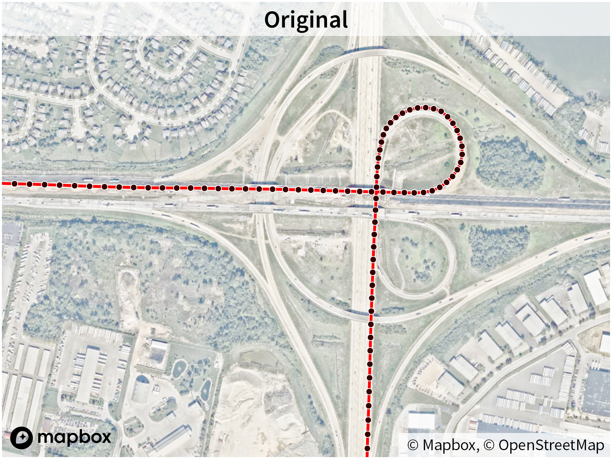
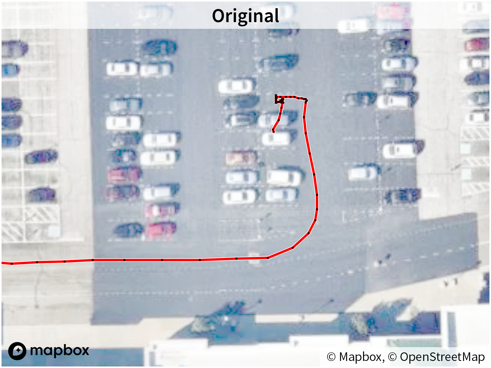

# GPS Log Tools

This repository contains a collection of scripts used for maintaining my [GPS driving logs](https://paulbogard.net/driving-logs/).

## Canonical Driving Log

The driving log is stored inside a [KML](https://developers.google.com/kml/documentation/kmlreference) file, with a location defined by the `files/canonical_kml` key in `config.toml`. All imports and changes are made to this file, and all exports are derived from this file.

### Placemarks

Each track is stored as a [Placemark](https://developers.google.com/kml/documentation/kmlreference#placemark) in the root [Document](https://developers.google.com/kml/documentation/kmlreference#document) element.

Each Placemark contains a UTC [TimeStamp](https://developers.google.com/kml/documentation/kmlreference#timestamp) for the first point in the track, and a [LineString](https://developers.google.com/kml/documentation/kmlreference#linestring) for the track coordinates.

Each Placemark should contain a `name` element matching the timestamp, in `YYYY-MM-DD HH:MM:SSZ` format.

Each Placemark may contain an optional `description` element.

Each Placemark may contain optional metadata in an [ExtendedData](https://developers.google.com/kml/documentation/kmlreference#extendeddata) element:

| displayName | value |
|-------------|:------|
| Creator     | Device or software used to create the track (e.g. `Bad Elf GPS Pro+`, `myTracks`) |
| VehicleOwner | `personal` or `rental` |


### Folders

The root Document element may contain one level of [Folder](https://developers.google.com/kml/documentation/kmlreference#folder) elements, each containing two or more Placemarks as described above. When creating KMZ exports of the driving data, the Placemarks in each Folder should be merged into a single track and placed in the root Document element.

## Import Scripts

### update_kml.py

This script is the heart of my GPS processing; it maintains my [canonical driving KML file](https://paulbogard.net/blog/20210209-how-i-store-my-driving-logs-2021/), imports GPX files into it (by providing one or more GPX files as arguments), and exports a processed KMZ file.

The import function ensures duplicate tracks are not imported (tracks are uniquely identified by the UTC timestamp of their first waypoint). As tracks may have been edited in the canonical KML file after import (see below), in the case of a matching timestamp, the existing track in the canonical KML file is kept and the matching GPX track is ignored.

The import function also does some processing on the GPX data due to the idiosyncrasies of the device that generated the GPS track. Which processing is performed on each device’s tracks is defined in `config.toml`.

Since I’m maintaining several decades of driving data, I want my KML files to be more optimized for size than Google Earth typically saves them as. In particular:

- Google Earth by default maintains the a separate style for each [Placemark](https://developers.google.com/kml/documentation/kmlreference#placemark), even if the styles are identical. Since all of my Placemarks are tracks with the same line width and color, this script generates KML/KMZ files with the style defined once, and every Placemark using it.
- By default, most GPS logging data includes latitude, longitude, and altitude. However, for my driving log, altitudes are irrelevant (all of my tracks have [`altitudeMode`](https://developers.google.com/kml/documentation/altitudemode) set as `clampToGround`). This script strips all altitude values, saving a significant amount of space over millions of waypoints.

Sometimes, it’s necessary to manually edit waypoints in the canonical file (for example, noisy data that it was not possible to remove with automated processing upon import). Likewise, it’s sometimes necessary to [merge two consecutive tracks together](https://paulbogard.net/blog/20211221-fixing-driving-log-inter-track-gaps/) (which can be done by grouping tracks that need to be merged into KML sub-folders). Once that editing has been done in the canonical KML file, this script can be run without (or with) import arguments to apply the above optimizations to the newly-edited tracks.

### process_import_folder.py

When downloading tracks from my Bad Elf GPS Pro+ datalogger or the myTracks app, I end up with either individual GPX files or a zipfile of GPX files. This script:

- looks at a designated import folder for any zipfiles matching Bad Elf or myTracks naming conventions, extracts the GPX files, and deletes the zipfiles,
- imports all GPX files in the import folder using `update_kml.py`, and
- moves all the GPX files to an archival folder, renaming them to a particular UTC timestamp format as necessary.

### Import from Garmin.ps1

Garmin automotive devices store all driving tracks in a single `current.gpx` file; the oldest tracks are removed as new tracks are recorded to maintain a roughly constant file size. This PowerShell script is designed to import this file on Windows, by:

- copies the `current.gpx` to an archive folder, renaming it with the UTC timestamp of the time the script is run, and
- imports the archived GPX file using `update_kml.py`.

### MacOS Download Garmin GPX.scpt

I’ve had difficulty mounting Garmin devices as directories under recent versions of MacOS. Instead, to get the Garmin’s `current.gpx` file, this AppleScript runs a backup using the Garmin Express application, then opens the backup folder (which contains `current.gpx`) in Finder. From there, `current.gpx` can be imported using `update_kml.py`.

## Utility Scripts

### filter_speed.py

Rather than starting and stopping a GPS logger at the beginning and end of every ride, it's sometimes beneficial to leave the logger running all day. However, if the logger is removed from the car, then walking may be recorded in addition to driving. This script removes all points below a specified speed threshold, which should be set just slightly above the user's walking speed.

### filter_timelog.py

Splits a GPX file's tracks into segments based on a CSV file of start and top times. This is intended for use with some sort of automated script which can generate a CSV file based on car start and stop times—for example, an iOS automation script that will generate the timestamps in an iCloud text file based on CarPlay connect and disconnect triggers.

The CSV file uses the following format:

```
status,time
1,2022-11-17T09:04:46-05:00
0,2022-11-17T10:09:00-05:00
1,2022-11-17T11:14:39-05:00
0,2022-11-17T11:51:41-05:00
```

`1` status indicates the start of a segment, and `0` indicates the stop of a segment. Tracks will be split into separate segments any time a `0` changes to a `1`, and any track points with a timestamp between adjacent `0` and `1` timestamps will be discarded.

### remove_outliers.py

Occasionally, GPS data may contain errors such as points located far outside of a driving track, or with an incorrect timestamp. This script looks for such outlier points within a GPX file, and removes those points.

### rename_bad_elf_gpx.py

Bad Elf GPX files are named as a timestamp, but the timestamp string filename format is slightly different depending on whether the GPX files were downloaded directly from the device over USB, or downloaded using the Bad Elf smartphone app over Bluetooth. This script renames the GPX files to a consistent timestamp format. 

### simplify_gpx.py

GPX tracks are often recorded at a given frequency (e.g. one waypoint per second). However, a lot of these points are unnecessary: while curvy parts of the track need a lot of points for smooth curves, straight parts of the track can have a lot of intermediate points removed without changing the shape of the track. This script runs the [Ramer–Douglas–Peucker algorithm](https://en.wikipedia.org/wiki/Ramer%E2%80%93Douglas%E2%80%93Peucker_algorithm) on the tracks of a GPX file to remove unneeded points, resulting in smaller data files.



### split_gpx_time.py

In some cases, GPX track segments may have large time gaps between points (e.g. if the vehicle is stopped and the GPS logger doesn't record points while not in motion). This script looks for time gaps between subsequent trackpoints within a track segment that are greater than or equal to a set threshold of seconds, and splits the track segment into multiple track segments.

### split_kmz.py

For a number of years, I kept all my driving data in a separate KMZ file for each trip I took, plus an annual KMZ file for local driving. When I converted the original GPX files into KMZ, I had also merged GPX [tracks](https://www.topografix.com/GPX/1/1/#type_trkType) with multiple [track segments](https://www.topografix.com/GPX/1/1/#type_trksegType) into a single KML [Placemark](https://developers.google.com/kml/documentation/kmlreference#placemark). Unfortunately, I only kept a single timestamp for the whole merged Placemark, and the timestamp was in the track's local timezone, rather than UTC.

This script helps me split these old merged KML Placemarks back into GPX tracks. It allows me to specify a timezone so that the timestamp can be converted to UTC, and it helps me generate reasonable unique timestamps for tracks which I don’t still have timestamp data for.

### trim_gpx.py

The GPS devices I use the most often are plugged into a car for power; when the car starts, the GPS devices turn on and start recording. When a GPS device is turned on, it may take a small amount of time to lock onto satellites and build up its confidence in its position. Thus, the initial points of the track may jump around a lot, resulting in the start of many tracks looking somewhat like a scribble. Also, the car is often not moving immediately after starting (or may sit for a while when parked before turning off the car), so a lot of the points at the beginning and end of the track may not be needed since the car is sitting still.

For GPX files which have a speed associated with each trackpoint, this script looks through each track for the first and last times a rolling median of speeds exceeds a certain threshold, and removes the points before the first time and after the last time.



Note that when using this script during an import, it’s important to record the first trackpoint’s timestamp before running this script, as the first trackpoint could be removed.